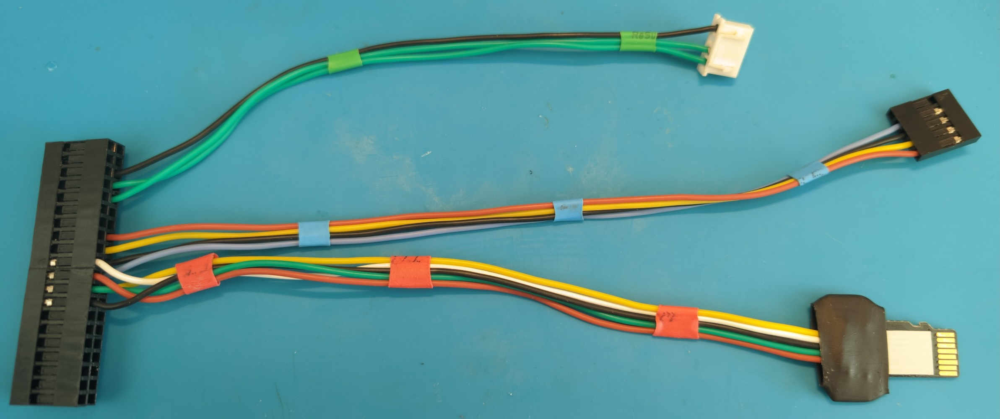
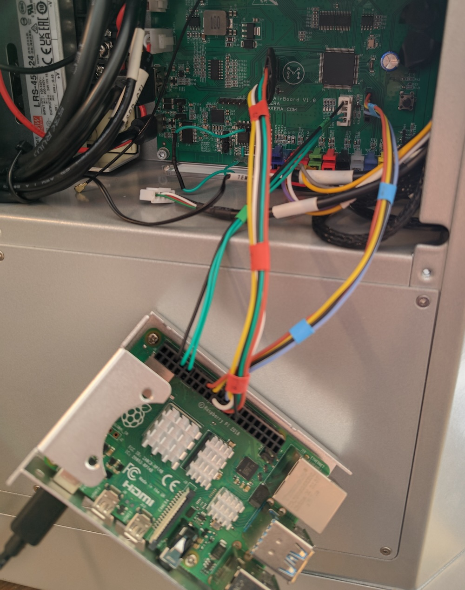

# electrophorus

**WARNING: The author(s) assume absolutely no responsibility for any damage and/or disappointment that might occur as a
result of following the instructions below. This project is currently still is heavily work in progress (almost nothing
works!) and would work only on Carvera Air. DO NOT TRY THIS AT HOME unless you understand what you're doing and are
willing to deal with the issues and fix the bugs yourself (I might help with that, though).**

Electrophorus is a project that allows you to convert a Carvera-family desktop CNC milling machine
by [Makera Inc.](https://www.makera.com/)
to use [LinuxCNC](https://linuxcnc.org/) as a controller with the help of
a [Raspberry Pi](https://www.raspberrypi.com/).

It works by offloading the realtime functions (pulsing the motor drivers) to the Carvera board/firmware, while the
computation-heavy parts (G code parsing, trajectory planning, motion control, etc.) are handled by LinuxCNC running on
the Raspberry Pi. If you're familiar with LinuxCNC concepts, the Carvera board acts as a Programmable Realtime Unit
(PRU) on BeagleBone or a limited version of a Mesa card.

I (@f355) don't have the big-brother Carvera (C1), so for now it is supposed to only work (or not) with
Carvera Air (CA1).

The project has started as a fork of the fantastic [Remora](https://github.com/scottalford75/Remora) project. The Remora
authors [say they "dont ...not support"](https://github.com/scottalford75/Remora/issues/78#issuecomment-2584956914)
LPC1768-based boards, so this is a hard-fork, the changes are not intended to be upstreamed, and the code has been
pretty much rewritten.

## Making it work (Carvera Air)

The communication between the machine's board and the Raspberry Pi is done over the SPI bus. Unfortunately, both SSP/SPI
interfaces on the board are populated - SSP0 by the SD card and SSP1 by the ESP8266-based Wi-Fi module. We won't need
either of those things, so we'll be plugging into the MicroSD port directly using a very cursed-looking cable. It is
possible to use the WiFi module pins too, but it is much harder since it requires physically modifying the board.

You'll need the following:

1. Carvera Air itself, obviously.
2. Raspberry Pi 4B (5 might work too, but I don't have one) with a suitable power supply and a MicroSD card.
3. Female Dupont 2.54mm / 0.1"-pitch pin header connector(-s) compatible with the Raspberry Pi. A single 40-pin
   connector is highly recommended.
4. MicroSD breakout board - a PCB with a MicroSD card shape on one end and solder points/terminals on the other. I used
   one end of a MicroSD extension cable, they're readily available on the internet. Alternatively, you can design such a
   PCB and cut it on the Carvera itself (please share your design if you do).
5. (Recommended) 5-pin female Dupont pin header connector for the SWD port (again, 2.54mm / 0.1" pitch).
6. (Optional) 4-pin female JST XH connector for the UART port. You should have one left over from wiring up
   the [3D probe](https://www.instructables.com/Carvera-Touch-Probe-Modifications/). :)
7. Wires to tie it all together, of a suitable gauge, and a way to do that (soldering iron, crimping tool, heatshrink,
   etc.)

### Making the cables

* The Raspberry Pi pins are numbered according to
  the [official pinout](https://www.raspberrypi.com/documentation/computers/raspberry-pi.html#gpio). The pin numbers
  refer to the physical connector pins, not the logical GPIO numbers.
* "Wire color" column is purely informational and refers to the colors on the photos below, feel free to use any colors
  you want.
* Keep the wires reasonably short - 10-15 cm is a good length. We're running stuff at pretty low speeds, so no need for
  shielded cables or anything like that, but meters of wire is not a good idea either.
* Double and triple check when done.

#### Connector J13 - SPI

It's the MicroSD port. Required - it's the main communication channel between the machine and LinuxCNC.

Pins are numbered according to the [MicroSD pinout](https://en.wikipedia.org/wiki/SD_card#Transfer_modes) in SPI mode.
Your breakout board might have extra grounds or even a completely different pinout on the cable side, make sure to
carefully check which pin is which. On the photos below, the black ground wire is in the "wrong" place because my board
had extra grounds, and it was more convenient to connect it there.

| J13 Pin# | Signal         | RPi pin# | Wire color    |
|----------|----------------|----------|---------------|
| 1        | NC             | NC       | Not connected |
| 2        | nCS / SPI CS   | 24       | Yellow        |
| 3        | DI / SPI MOSI  | 19       | White         |
| 4        | 3V3            | NC       | Not connected |
| 5        | CLK / SPI SCLK | 23       | Green         |
| 6        | GND            | 25       | Black         |
| 7        | DO / SPI MISO  | 21       | Orange        |
| 8        | NC             | NC       | Not connected |

#### Connector J12 - SWD/Reset

It's a 5-pin Dupont pin header below and to the right of the MCU, next to J3, used for flashing, resetting and debugging
the firmware. You can omit it and flash the firmware using an SD card, but it is much more convenient to do it without
unplugging the cable.

Pins are numbered bottom-to-top, according to the silkscreen.

| J12 Pin# | Signal | RPi pin# | RPi GPIO# | Wire color    |
|----------|--------|----------|-----------|---------------|
| 1        | 3V3    | NC       | N/A       | Not connected |
| 2        | SWDIO  | 22       | 25        | Blue          |
| 3        | GND    | 20       | N/A       | Black         |
| 4        | SWDCLK | 18       | 24        | Yellow        |
| 5        | RESET  | 16       | 23        | Orange        |

#### Connector J3 - UART

It's a 4-pin JST-XH connector right below the MCU, where the unused CAM cable was plugged in, used to see the firmware
console output, mostly for debugging/informational purposes. You can omit this part if you want.

Pins are numbered top-to-bottom, according to the silkscreen.

**NOTE: the board RX should be connected to the RPi TX and vice versa!**

| J3 Pin# | Signal | RPi pin# | Wire color    |
|---------|--------|----------|---------------|
| 1       | GND    | 6        | Black         |
| 2       | 3V3    | NC       | Not connected |
| 3       | RX/TX  | 10       | Green         |
| 4       | TX/RX  | 8        | Green         |

#### Result

The resulting cable should look something like this:

All connected together:

Please excuse the crudity of the model, I didn't have time to build it to scale or to paint it. Coming up with a way to
permanently mount the Raspberry Pi while providing adequate cooling is left as an exercise to the reader.

### Building the firmware

Follow the [official Mbed CE instructions](https://mbed-ce.dev/getting-started/toolchain-install/). Use this repo
instead of the `mbed-ce-hello-world`, `Release` build type and `LPC1768` target.

If you're doing this on the Raspberry Pi itself, and it is connected to the machine, you can flash the firmware with
`sudo ninja flash-electrophorus`.

Instead of flashing the firmware through SWD - e.g. if you've chosen to not connect that port - you can rename
`build/electrophorus.bin` to `firmware.bin` and put it in the root folder of the SD card as usual. The firmware is
(obviously) not using the SD card at all, so you can leave the rest of the files on it.

We're not touching the bootloader, so to go back to the [stock](https://github.com/MakeraInc/CarveraFirmware/releases)
or [community](https://github.com/Carvera-Community/Carvera_Community_Firmware/releases) firmware you just need to
download it, rename it to `firmware.bin` and put it on the SD card.

### Configuring LinuxCNC

Coming soon, carefuling is in progress.

## Historical: Remora - the original README

The full documentation is at <https://remora-docs.readthedocs.io/en/latest/>
Note: Docs have not been updated for 1.0.0_rc

Remora is a free, opensource LinuxCNC component and Programmable Realtime Unit (PRU) firmware to allow LPC176x and
STM32F4 based controller boards to be used in conjuction with a Raspberry Pi to implement a LinuxCNC based CNC
controller.

Having a low cost and accessable hardware platform for LinuxCNC is important if we want to use LinuxCNC for 3D printing
for example. Having a controller box the size of the printer itself makes no sense in this applicatoin. A SoC based
single board computer is ideal in this application. Although developed for 3D Printing, Remora (and LinuxCNC) is highly
flexible and configurable for other CNC applications.

Remora has been in use amd development since 2017. Starting on Raspberry Pi 3B and 3B+ eventhough at the time it was
percieved that the Raspberry Pi was not a viable hardware for LinuxCNC.

With the release of the RPi 4 the LinuxCNC community now supports the hardware, with LinuxCNC and Preempt-RT Kernel
packages now available from the LinuxCNC repository. This now greatly simplifies the build of a Raspberry Pi based CNC
controller.
